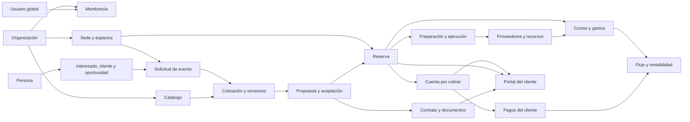

# Claridez — Blueprint maestro del producto funcional

- **Versión:** 1.0
- **Estado:** fuente maestra del destino funcional
- **Fecha:** 2 de agosto de 2026
- **Mercado inicial:** Ecuador

## 1. Función de este documento

Este Blueprint define cómo debe quedar Claridez cuando el producto funcional esté terminado. Fija
el propósito, los límites, la experiencia, los módulos, la propiedad conceptual de datos y los
requisitos verificables comunes. Define el destino funcional completo, no una entrega reducida.

No es un catálogo exhaustivo de tablas o campos. Las especificaciones aprobadas de 5.1 y 5.2
continúan gobernando sus flujos exactos ya implementados. Una etapa futura debe conservar esos
contratos o cambiarlos de forma explícita, con migración y compatibilidad demostradas. Las
decisiones transversales, de seguridad, datos, concurrencia, infraestructura o difícil reversión
requieren ADR cuando llegue su implementación.

El [Roadmap de entrega](PRODUCT_DELIVERY_ROADMAP.md) ordena la construcción desde el estado real y
el [Handoff](../PROJECT_HANDOFF.md) conserva el punto exacto de continuidad. La
[línea base v0.1](PRODUCT_BASELINE.md) queda como antecedente histórico, no como definición completa
del destino.

## 2. Propósito, mercado y problema

Claridez es una plataforma SaaS B2B multiempresa para que propietarios y equipos de salones y
espacios de eventos organicen, controlen y comprendan su gestión comercial, agenda, operación y
finanzas en un solo centro de control claro.

Su mercado inicial son salones, quintas, haciendas, centros de recepciones y espacios para eventos
sociales en Ecuador, especialmente negocios pequeños y medianos que combinan local, decoración,
alimentación y servicios complementarios. El producto parte de USD y `America/Guayaquil`, con
moneda y zona horaria configuradas por organización.

Claridez resuelve la fragmentación entre chats, cuadernos, calendarios, hojas de cálculo,
cotizaciones, contratos, comprobantes, gastos y archivos. Debe reducir oportunidades olvidadas,
conflictos de agenda, preparación incompleta, cobros sin seguimiento, costos desconectados y falta
de claridad sobre la rentabilidad real de cada evento y del negocio.

La promesa que guía el resultado es: **Todo tu negocio, claro y bajo control.**

## 3. Resultado y límites del producto

El producto funcional terminado permite, de extremo a extremo:

1. configurar una organización, sus sedes, equipo, perfiles y catálogo;
2. captar y organizar interesados y clientes;
3. preparar, versionar, enviar y aceptar propuestas y contratos;
4. comprobar disponibilidad, reservar, reprogramar y cancelar sin solapamientos indebidos;
5. preparar y ejecutar el evento con responsables, recursos, documentos y trazabilidad;
6. registrar los pagos que el salón recibe de sus clientes, controlar saldos y cuentas por cobrar;
7. relacionar costos y gastos con eventos y periodos para conocer flujo y rentabilidad;
8. coordinar proveedores, mobiliario, equipos e inventario;
9. comunicarse con el cliente mediante formularios, recordatorios y un portal seguro;
10. consultar indicadores, reportes y exportaciones consistentes con la verdad del backend;
11. operar Claridez de forma segura en staging y producción, con respaldo, recuperación y soporte.

Claridez administra el negocio del espacio de eventos. No es un ERP genérico, una red social, un
sistema de venta de entradas ni una plataforma que organice por sí misma el evento. Tampoco debe
retener fondos de clientes ni presentarse como banco, procesador contable o asesor legal.

### Diferimiento deliberado

No son condición para declarar terminado el producto funcional descrito aquí:

- planes, cobro y pasarela de las suscripciones de Claridez;
- facturación electrónica;
- contabilidad formal o libro mayor contable;
- aplicaciones móviles nativas;
- marketplace;
- automatizaciones avanzadas con inteligencia artificial;
- expansión internacional;
- constructor libre de sitios web.

La arquitectura debe permitir incorporarlos después sin anticipar sus entidades, proveedores o
reglas. En particular, **los pagos que cada salón recibe de sus clientes sí son núcleo funcional**;
**el cobro de la suscripción SaaS de Claridez pertenece a una etapa posterior de monetización**.

## 4. Personas usuarias y perfiles

### 4.1 Tipos de usuario

- **Equipo de la organización:** propietarios, administradores y colaboradores que trabajan en los
  dominios comercial, operativo o financiero.
- **Interesado o cliente:** persona externa que solicita información, revisa una propuesta, entrega
  datos, acepta documentos, consulta su evento y observa sus pagos mediante superficies públicas o
  portal autenticado.
- **Proveedor o colaborador externo:** tercero relacionado con compras, servicios o recursos. En la
  primera versión funcional no obtiene acceso general al workspace; solo recibe comunicaciones o
  enlaces acotados cuando una etapa lo apruebe.
- **Operador interno de Claridez:** personal autorizado para soporte y operación de la plataforma.
  Su identidad, permisos y superficie están separados de las membresías de clientes.

### 4.2 Perfiles organizacionales

Se conservan los cinco perfiles iniciales:

- `propietario`: control general de la organización, seguridad, equipo y visibilidad integral;
- `administrador`: administración cotidiana con límites expresos sobre propietarios y seguridad;
- `comercial`: personas, oportunidades, solicitudes, propuestas, contratos y coordinación de
  reservas;
- `operaciones`: preparación, ejecución, recursos y coordinación logística;
- `finanzas`: cobros, cuentas por cobrar, costos, gastos, flujo y rentabilidad.

Los perfiles agrupan capacidades, pero no crean jerarquías implícitas. La autorización continúa
backend-first y deny-by-default. Toda ampliación se expresa mediante capacidades concretas y
pruebas de matriz; Django `is_staff`, `is_superuser`, grupos o permisos técnicos no sustituyen
`Membership`.

## 5. Experiencia completa de extremo a extremo

1. El propietario configura identidad comercial, moneda, zona horaria, sedes, espacios, políticas
   operativas, equipo y catálogo. Invita miembros y asigna perfiles.
2. Una consulta entra desde carga interna, formulario público o canal integrado. Claridez identifica
   o crea la persona sin duplicarla dentro de la organización y registra origen, consentimiento y
   seguimiento.
3. Comercial califica la necesidad, verifica agenda y crea una solicitud u oportunidad con evento,
   sede, espacio, fecha, invitados y requerimientos.
4. El equipo construye una cotización desde catálogo y líneas autorizadas. Cada emisión conserva
   versión, precios, descuentos, vigencia y snapshots históricos.
5. El cliente recibe una propuesta clara, puede revisarla y aceptarla. Cuando corresponde, se genera
   contrato desde una plantilla versionada y se conserva la evidencia de aceptación o firma.
6. La reserva se mantiene provisional mientras se completan las condiciones aprobadas. Al confirmar,
   Claridez protege la agenda y crea la preparación operativa de forma atómica.
7. Finanzas registra anticipos, abonos, pagos, ajustes o devoluciones del cliente sin alterar el
   historial. El sistema muestra saldo y vencimientos; no confunde esa actividad con la suscripción
   a Claridez.
8. Operaciones asigna responsables, resuelve checklist, documentos, proveedores y recursos, declara
   listo, inicia y completa el evento. Reprogramaciones y cancelaciones coordinan todos los dominios
   afectados sin inventar historia.
9. Los costos directos, consumos, gastos variables y recurrentes se relacionan con el evento o el
   periodo. El backend calcula flujo y rentabilidad con reglas monetarias trazables.
10. El cliente consulta por portal la información que le corresponde, documentos, próximos hitos y
    estado de pagos; las comunicaciones respetan canal, consentimiento y preferencias.
11. Propietarios y responsables consultan dashboards y reportes desde datos autorizados. Cada
    exportación aplica la misma minimización y alcance que la pantalla de origen.

## 6. Módulos definitivos

| Módulo | Responsabilidad | Límite explícito |
| --- | --- | --- |
| Plataforma y organizaciones | Identidad global, organizaciones, sedes, membresías, perfiles, contexto, configuración y seguridad de cuenta. | No posee datos funcionales de eventos ni sustituye capacidades de producto. |
| Personas y CRM | Personas, interesados, clientes, oportunidades, fuentes, interacciones, responsables y seguimientos. | No posee cotizaciones emitidas, reservas, cobros ni operación. |
| Catálogo comercial | Tipos de evento, servicios, productos, paquetes, precios vigentes y condiciones comerciales reutilizables. | No modifica versiones históricas ya emitidas ni administra existencias físicas. |
| Solicitudes y propuestas | Solicitudes, cotizaciones, versiones, líneas, propuestas, aceptación y snapshots comerciales. | No procesa dinero ni decide la disponibilidad final sin Agenda. |
| Agenda y reservas | Sedes/espacios reservables, disponibilidad, bloqueos, reservas, montaje/desmontaje, reprogramaciones y cancelaciones. | No es un calendario personal genérico ni duplica la operación del evento. |
| Operación de eventos | Preparación, checklist, responsables, ejecución, incidencias y cierre operativo. | No es gestor genérico de proyectos ni propietario del contrato o del saldo. |
| Contratos y documentos | Plantillas, versiones, contratos, aceptación/firma, archivos, metadatos y PDF verificable. | No define asesoría legal ni facturación electrónica. |
| Cobros y cuentas por cobrar | Anticipos, abonos, pagos de clientes, asignaciones, vencimientos, saldos, recibos, ajustes y devoluciones registradas. | No cobra la suscripción de Claridez ni constituye contabilidad formal. |
| Costos, gastos y rentabilidad | Costos directos, gastos recurrentes/variables, movimientos de caja operativos, presupuestos y rentabilidad. | No implementa libro mayor, declaraciones fiscales ni estados contables certificados. |
| Proveedores, recursos e inventario | Proveedores, compras operativas, mobiliario, equipos, existencias, reservas de recursos y movimientos. | No es marketplace ni sistema avanzado de cadena de suministro. |
| Formularios, comunicaciones y portal | Captación pública, mensajes, recordatorios, preferencias y portal seguro del cliente. | No crea un constructor web libre ni expone el workspace interno. |
| Analítica y reportes | Indicadores, embudos, agenda, operación, cartera, flujo, rentabilidad, reportes y exportaciones. | No recalcula reglas críticas en React ni crea una segunda verdad analítica. |
| Administración interna de Claridez | Estado de tenants, soporte, operación, incidentes, uso y controles de acceso interno. | No otorga acceso transversal por defecto ni mezcla soporte con membresías de clientes. |
| Operación de plataforma | CI/CD, staging, producción, secretos, respaldo, recuperación, monitoreo y runbooks. | No define por sí sola planes comerciales ni facturación de la suscripción. |

## 7. Mapa conceptual y relaciones

Todas las entidades privadas pertenecen a una organización. Las relaciones privadas incluyen el
tenant en sus restricciones efectivas y se materializan dentro de `authorized_tenant_scope`. Los
datos globales son excepciones expresas: identidad de usuario y tablas de control ya aprobadas, y
la administración interna estrictamente separada.

## 8. Propiedad de datos entre módulos

| Dato | Módulo propietario | Consumidores autorizados |
| --- | --- | --- |
| Usuario, organización, membresía y configuración | Plataforma y organizaciones | Todos mediante proyecciones y capacidades mínimas. |
| Persona, consentimiento e interacción | Personas y CRM | Comercial; portal y finanzas solo proyecciones necesarias. |
| Definiciones y precios de catálogo | Catálogo comercial | Propuestas, reservas, operación y analítica mediante versiones. |
| Solicitud, cotización y aceptación | Solicitudes y propuestas | Agenda, contratos, cobros y operación mediante snapshots estrechos. |
| Intervalo, sede, espacio y estado de reserva | Agenda y reservas | Operación, comunicaciones, documentos, finanzas y reportes. |
| Checklist, ejecución e incidencias | Operación | Comercial en lectura mínima, recursos y analítica. |
| Plantilla, contrato, archivo y PDF | Contratos y documentos | Portal y módulos vinculados según propósito. |
| Cuenta por cobrar y pago del cliente | Cobros y cuentas por cobrar | Comercial en estado resumido, portal del cliente y analítica financiera. |
| Costo, gasto y movimiento de caja | Costos, gastos y rentabilidad | Finanzas, propietarios y analítica autorizada. |
| Proveedor, recurso, existencia y movimiento | Proveedores, recursos e inventario | Operación, costos y agenda según necesidad. |
| Entrega y preferencia de comunicación | Comunicaciones y portal | Módulo originador y auditoría autorizada. |

Un módulo consume puertos o proyecciones públicas estrechas. No consulta de forma dispersa tablas
ajenas ni copia información viva salvo que un snapshot histórico aprobado lo exija.

## 9. Ciclos de vida principales

### 9.1 Persona y relación comercial

Una persona puede ser interesada antes de comprar y cliente desde su primera reserva confirmada.
La identidad maestra se conserva aunque una oportunidad se pierda. Las interacciones y tareas de
seguimiento forman una secuencia trazable; fusionar duplicados, anonimizar o eliminar requiere una
política explícita de privacidad y no borra evidencias que deban conservarse legalmente.

### 9.2 Solicitud, propuesta y reserva

Se conserva el flujo vigente `new → quoted → accepted → confirmed`, con `closed_lost` antes de
confirmar y `cancelled` después de haber confirmado. Cotizaciones y propuestas se versionan; una
versión emitida o aceptada es inmutable. La evolución futura añade catálogo, contratos,
reprogramación y espacios múltiples sin reescribir silenciosamente la historia 5.1.

La reprogramación crea evidencia del intervalo anterior, valida nuevamente disponibilidad y
coordina contrato, operación, recursos, comunicaciones y vencimientos financieros. La cancelación
registra actor, razón, consecuencias económicas y efectos operativos; nunca se representa con un
borrado.

### 9.3 Operación

Se conserva `preparing → ready → in_progress → completed` y la cancelación comercial permitida
antes de ejecutar. Las ampliaciones futuras pueden incorporar plantillas, montaje, incidencias y
cierre posterior, pero deben preservar la transición histórica append-only y la concurrencia de
5.2.

### 9.4 Cobros del cliente

Una reserva o contrato genera obligaciones por cobrar con uno o más vencimientos. Un pago recibido
se registra de forma inmutable con método, fecha, referencia y evidencia; puede asignarse a una o
varias obligaciones según una regla aprobada. Correcciones usan reversos o ajustes enlazados, no
edición destructiva. El saldo es un cálculo canónico del backend. Recibos y estados de cuenta se
generan desde esa verdad.

### 9.5 Costos, gastos e inventario

Un costo puede planificarse y luego registrarse como real para un evento. Un gasto recurrente se
programa por periodo y un gasto variable puede vincularse a evento, sede o negocio. Los movimientos
de inventario conservan origen, destino, cantidad y responsable. La rentabilidad compara ingresos
reconocidos por la regla funcional aprobada con costos y gastos asignados, siempre con `Decimal`,
redondeo documentado y trazabilidad.

## 10. Capacidades y permisos

La matriz siguiente define el destino por familias. Cada etapa traduce la familia a capacidades
atómicas, endpoints y pruebas sin conceder permisos por inferencia.

| Familia | `propietario` | `administrador` | `comercial` | `operaciones` | `finanzas` |
| --- | --- | --- | --- | --- | --- |
| Organización y configuración | Administrar | Administrar salvo controles exclusivos de propietario | Leer lo necesario | Leer lo necesario | Leer lo necesario |
| Propietarios y seguridad sensible | Administrar con MFA y último propietario protegido | Sin gestión de propietarios | Sin acceso | Sin acceso | Sin acceso |
| Miembros no propietarios | Administrar | Administrar | Sin acceso | Sin acceso | Sin acceso |
| Personas y CRM | Administrar | Administrar | Administrar | Proyección operacional mínima | Proyección de cobro mínima |
| Catálogo y precios | Administrar | Administrar | Administrar oferta | Leer definiciones operativas | Leer valores financieros |
| Solicitudes y propuestas | Administrar | Administrar | Administrar | Leer snapshot aceptado | Leer y confirmar condiciones financieras autorizadas |
| Agenda y reservas | Administrar | Administrar | Gestionar solicitud y propuesta; cancelación crítica restringida | Leer y coordinar ejecución | Leer y confirmar evidencia de cobro según capacidad |
| Operación | Administrar y ejecutar | Administrar y ejecutar | Leer | Administrar y ejecutar | Sin acceso salvo proyección futura aprobada |
| Contratos y documentos | Administrar | Administrar | Preparar y gestionar | Leer documentos operativos asignados | Leer documentos financieros asignados |
| Cobros y cuentas por cobrar | Administrar | Administrar | Leer estado resumido | Sin acceso | Administrar |
| Costos, gastos y rentabilidad | Administrar | Administrar | Sin acceso salvo precio comercial propio | Registrar evidencia operativa autorizada sin aprobar | Administrar |
| Proveedores, recursos e inventario | Administrar | Administrar | Leer disponibilidad pertinente | Administrar operación y movimientos | Administrar términos y costos autorizados |
| Comunicaciones | Administrar | Administrar | Gestionar comunicaciones comerciales | Gestionar comunicaciones operativas | Gestionar recordatorios de cobro |
| Analítica y exportación | Visión integral | Visión integral operativa | Ámbito comercial | Ámbito operativo | Ámbito financiero |

Una exportación nunca amplía permisos. Las acciones sensibles —propietarios, sesiones, exportación
masiva, cambios financieros, acceso interno y secretos— requieren autenticación reforzada,
auditoría y, donde corresponda, doble confirmación o separación de funciones.

## 11. Navegación y pantallas previstas

### Workspace privado

- **Inicio:** prioridades, agenda próxima, cartera, bloqueos y resultados según el rol.
- **Comercial:** bandeja de interesados, personas/clientes, oportunidades, solicitudes,
  cotizaciones y propuestas.
- **Agenda:** calendario por sede/espacio, disponibilidad, bloqueos, reservas, reprogramaciones y
  cancelaciones.
- **Operación:** próximos eventos, preparación, ejecución, incidencias y cierre.
- **Documentos:** contratos, plantillas, archivos y PDF vinculados.
- **Finanzas:** cuentas por cobrar, pagos, saldos, costos, gastos, flujo y rentabilidad.
- **Recursos:** proveedores, mobiliario, equipos, inventario y movimientos.
- **Reportes:** indicadores, reportes guardados y exportaciones.
- **Configuración:** negocio, sedes, catálogo, equipo, roles, plantillas, canales e integraciones.

Cada sección dispone de lista/búsqueda, detalle, estados vacíos, carga, error, conflicto y acciones
contextuales. En móvil usa navegación compacta y cards sin scroll horizontal; las acciones
críticas nunca dependen de hover.

### Superficies externas

- formulario público de consulta con consentimiento y protección antiabuso;
- propuesta y contrato compartidos mediante enlace seguro de duración y alcance limitados;
- portal del cliente para evento, documentos, pagos y comunicaciones;
- administración interna de Claridez en una superficie separada del workspace tenant.

No se muestran módulos vacíos. Una entrada aparece cuando la etapa está implementada y el actor
tiene la capacidad requerida.

## 12. Catálogos, archivos, documentos e integraciones

### Catálogos

Tipos de evento, servicios, productos y paquetes son configurables por organización y versionables.
Una propuesta emitida conserva descripciones y precios históricos aunque el catálogo cambie. Se
permiten líneas excepcionales autorizadas sin convertirlas automáticamente en catálogo.

### Archivos y PDF

Los archivos privados conservan organización, propietario conceptual, vínculo de dominio, nombre
seguro, tipo, tamaño, checksum, versión y marcas. Se almacenan fuera de la base en almacenamiento
de objetos privado, con cifrado, URLs temporales, límites, validación de tipo y análisis de malware.
No se aceptan rutas públicas predecibles. Borrado, retención y legal hold siguen una política
aprobada.

Los PDF de propuesta, contrato, recibo y reporte se generan en servidor desde datos y plantillas
versionados. Un documento emitido conserva su hash y snapshot; regenerarlo no modifica la evidencia
anterior.

### Integraciones previstas

- proveedor productivo de correo;
- WhatsApp Business u otro canal aprobado, con consentimiento y plantillas autorizadas;
- almacenamiento de objetos y análisis de archivos;
- motor de PDF y, si se aprueba legalmente, firma electrónica;
- exportación/sincronización de calendario mediante estándares y proveedores evaluados;
- medios externos que el salón use para recibir pagos, sin mezclar cuentas de fondos con Claridez;
- monitoreo de errores y operación.

Cada proveedor exige evaluación de costo, privacidad, residencia, portabilidad, límites,
recuperación, dependencia y salida. Las organizaciones, membresías, autorización y verdad de
negocio permanecen propiedad de Claridez.

## 13. Notificaciones y procesos asíncronos

Claridez ofrece notificaciones dentro de la aplicación y entregas externas para seguimientos,
vencimientos de propuestas, reservas, preparación, documentos, próximos eventos, pagos pendientes
y cambios relevantes. Cada entrega conserva plantilla/version, destinatario, canal, consentimiento,
estado, intentos y causa final; nunca registra secretos o contenido sensible innecesario en logs.

Los primeros candidatos asíncronos son correo/WhatsApp, generación pesada de PDF, análisis de
archivos, exportaciones, recordatorios programados y agregados analíticos. Al implementar el primero
se debe decidir cola, outbox, idempotencia, reintentos, dead letters, orden, monitoreo y operación
mediante ADR. Ninguna notificación puede ser la única defensa de una invariante transaccional.

## 14. Analítica y administración interna

### Analítica del negocio

- consultas, oportunidades, tiempos de respuesta y conversión;
- cotizaciones emitidas, aceptadas, perdidas y valor del pipeline;
- ocupación por sede/espacio, cancelaciones y reprogramaciones;
- preparación, atrasos, bloqueos y cumplimiento operativo;
- anticipos, pagos, saldo, antigüedad de cartera y cobro esperado;
- costos planificados/reales, gastos por categoría, flujo y rentabilidad por evento, sede y periodo;
- uso, disponibilidad y merma de recursos e inventario.

Los indicadores declaran definición, zona horaria, moneda, periodo y filtros. Los cálculos críticos
viven en backend y se prueban con bordes y concurrencia. React presenta la respuesta; no crea una
segunda regla financiera.

### Administración interna de Claridez

La plataforma interna permite observar estado de organizaciones, versiones desplegadas, consumo
técnico, incidentes, entregas fallidas y solicitudes de soporte. Un operador no obtiene acceso a
datos privados por ser `is_staff`. Cualquier acceso excepcional requiere MFA, justificación,
alcance mínimo, tiempo limitado, aprobación cuando el riesgo lo exija y auditoría inmutable. Debe
existir una vista para revisar y revocar ese acceso.

Planes, trials, límites comerciales, facturas y cobro de suscripción se incorporan únicamente en la
etapa posterior de monetización.

## 15. Requisitos transversales

### Seguridad y privacidad

- sesiones de servidor, CSRF, cookies seguras, expiración absoluta y revocación conservan ADR 0010;
- MFA es obligatoria antes de acciones privilegiadas en producción;
- rate limiting, protección antiabuso, cabeceras seguras y confianza de proxy se definen para la
  topología productiva;
- secretos se inyectan desde un gestor apropiado, se rotan y nunca viven en Git o artefactos;
- datos en tránsito usan TLS y los proveedores cifran datos y respaldos en reposo;
- se aplica minimización, propósito, consentimiento, retención, exportación, rectificación,
  anonimización y eliminación conforme a la normativa aplicable y a una política legal aprobada;
- datos reales no se copian a desarrollo y staging usa datos sintéticos o anonimizados;
- dependencias, imágenes y código se auditan de forma continua; vulnerabilidades tienen proceso de
  triage y parcheo;
- una auditoría de acciones sensibles es distinta de logs operativos y no admite edición ordinaria.

### Aislamiento multiempresa

- todo dato privado tiene organización y relaciones tenant-aware;
- `authorized_tenant_scope` cubre validación, consulta, escritura y materialización;
- RLS `ENABLE` + `FORCE` es defensa obligatoria para tablas privadas;
- archivos, cachés, exportaciones, tareas, métricas con dimensiones tenant y búsquedas conservan el
  mismo límite;
- pruebas negativas usan al menos dos organizaciones para API, ORM, SQL, bulk, archivos y procesos
  asíncronos;
- soporte transversal nunca usa un «tenant global» implícito.

### Integridad, auditoría y concurrencia

- dinero usa `Decimal`, moneda explícita y redondeo documentado;
- documentos, versiones emitidas, pagos y transiciones conservan historia mediante inmutabilidad,
  reversos o eventos append-only;
- revisiones optimistas protegen edición humana y locks/constraints protegen invariantes
  concurrentes;
- cada coordinación entre módulos declara orden de bloqueos, atomicidad, reintento e idempotencia;
- migraciones preservan datos, tienen cutover y reversión o recuperación documentados y se ensayan
  contra PostgreSQL real.

### Accesibilidad y experiencia

- objetivo WCAG 2.2 AA para los flujos del producto;
- uso completo con teclado, foco visible y orden lógico;
- labels persistentes, landmarks, headings y mensajes anunciados;
- targets táctiles de al menos 44 px, soporte desde 320 px y sin dependencia exclusiva del color;
- estados de carga, vacío, error, éxito, permisos y conflictos son explícitos;
- español claro, consistente con la marca y sin jerga técnica para clientes.

### Rendimiento y escala

- listados son paginados, ordenados e indexados; exportaciones grandes salen del ciclo HTTP;
- en un conjunto representativo, las operaciones interactivas ordinarias deben lograr p95 de API
  menor a 500 ms excluyendo proveedores externos, y las pantallas clave LCP menor a 2,5 s en una
  conexión móvil moderna;
- se fijan presupuestos de consultas y tamaño de payload para rutas críticas;
- el monolito modular puede escalar horizontalmente como aplicación stateless mientras PostgreSQL
  mantiene las transacciones; no se introducen microservicios sin evidencia;
- partición, réplicas, pooling o extracción de componentes se evalúan por métricas reales.

### Modularidad, mantenibilidad y extensibilidad

- cada módulo posee datos y superficie pública; imports transversales se prueban;
- API REST bajo `/api/v1` y OpenAPI validado constituyen el contrato ejecutable;
- el cliente TypeScript generado se incorpora cuando el contrato estabilizado y el costo de
  duplicación lo justifiquen;
- pruebas unitarias, integración PostgreSQL, contrato, accesibilidad y flujos críticos acompañan
  cada etapa;
- dependencias nuevas tienen necesidad, dueño, versión fijada, estrategia de actualización y salida;
- código muerto, compatibilidad vencida y artefactos se eliminan con evidencia.

### Observabilidad y operación productiva

- logs estructurados con correlación, sin secretos ni PII innecesaria;
- seguimiento de errores, métricas técnicas y de jobs, dashboards y alertas accionables;
- salud y readiness diferenciadas; despliegues identificables por versión;
- staging aislado y representativo, producción con despliegue automatizado y aprobación;
- migraciones se ejecutan con rol separado y procedimientos de cutover;
- backups automáticos con recuperación punto en el tiempo apuntan a RPO máximo de 15 minutos y RTO
  máximo de 4 horas; restauraciones se ensayan al menos trimestralmente;
- runbooks cubren despliegue, rollback/corrección hacia adelante, pérdida de proveedor, restauración,
  rotación de secretos, incidentes y comunicación;
- capacidad, disponibilidad y costos se revisan antes de compromisos comerciales.

## 16. Definición verificable de producto funcional terminado

Claridez puede declararse funcionalmente terminado cuando, y solo cuando:

1. todas las etapas hasta «Staging, producción y endurecimiento final» del Roadmap están completadas;
2. el flujo extremo a extremo de la sección 5 funciona en web responsive con los cinco perfiles y
   con un cliente externo;
3. organizaciones, sedes, equipo, catálogos, CRM, propuestas, agenda, operación, contratos,
   documentos, cobros, costos, recursos, comunicaciones, portal y reportes entregan sus resultados
   visibles sin módulos simulados;
4. los pagos recibidos de clientes, saldos, cuentas por cobrar, costos, gastos, flujo y rentabilidad
   se calculan en backend con trazabilidad y pruebas monetarias;
5. dos organizaciones no pueden leer, inferir, relacionar, exportar ni procesar datos entre sí en
   ninguna superficie;
6. la matriz de capacidades, MFA privilegiada, auditoría sensible, privacidad y retención están
   implementadas y probadas;
7. OpenAPI corresponde a las respuestas reales, el frontend consume el contrato estable y no quedan
   incompatibilidades de datos o migraciones pendientes;
8. las pantallas críticas cumplen la revisión de accesibilidad, responsive y rendimiento con datos
   representativos;
9. staging reproduce el artefacto productivo y producción dispone de CI/CD, monitoreo, alertas,
   backups, restauración ensayada, runbooks y responsables;
10. no existe un riesgo crítico abierto ni una decisión bloqueante sin dueño; las exclusiones de la
    sección 3 permanecen claramente diferidas.

La monetización de la suscripción de Claridez puede comenzar después. Su ausencia no invalida la
completitud funcional del producto para gestionar un salón y sus eventos.
